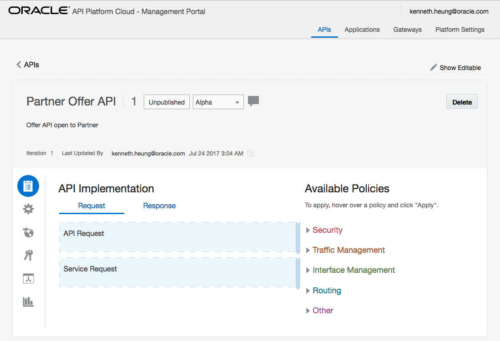
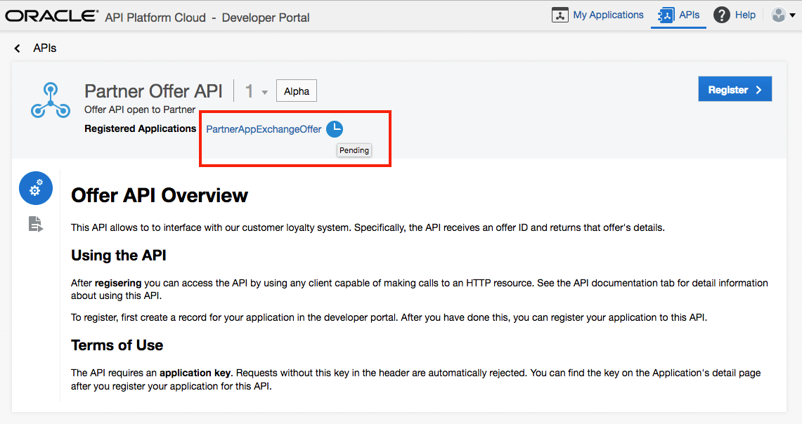

Update: July 24, 2017

## 0.1 Introduction

This lab is an extension of the APAC Cloud Test Drive and is about  using API Platform Cloud Service

## 0.2 Objectives

As API Platform Admin / Manager
- Create a new API
- Connect the API to backend services
- Apply policies to API
- Deploy API to Gateway
- Publish API to Developer Portal for search, view, register and consume
- Approve Application Registration

As Application Developer
- Create Application and Generate Application key
- Search and View available API(s)
- Register application to consume API
- View application and API usage

## 0.3 Required Artifacts

- completed APAC Cloud Test Drive Microservice Lab - have the Offer API ready as backend service
- this lab requires an Oracle API Platform Cloud Service account that will either be applied by yourself or supplied by your instructor
- an API Platform Gateway has been deployed and configured
- API documentation using HTML or Markdown. Samples of API Documentations can be [DOWNLOADED here](api-documentation/) (right click each .md file and save to your local harddisk)
- you will also need to use Postman to test the API

# 1. Create API in API Platform Cloud Service

## 1.1 Login to API Platform Cloud Service as API Administrator / Manager

- Use a Web Browser, navigate to API Platform, the URL of API Platform will be provided by your instructor    
  https://{apiplatorm-host-name}/apiplatform/

- Enter the credential provided by your instructor and click [**Sign In**] button. After login you will see the API Platform Cloud Service Landing page.
- **Make sure you are in the** [**APIs**] **tab**

## 1.2 Create API

- Click [**Create API**] button and enter the following information   
**Name**: `Partner Offer API`  (**if you are using SHARED environment, use** `Partner Offer API XX`, where XX is your group number: 01-20)  
**Version**: `1`  
**Description**: `Offer API open to Partner`
- Click [**Create**] button

- After you clicked the Create button, you will go back to the API main screen. You will now see the API just created.
- Next, click the API name you just created to EDIT the API. **Make sure you are chossing your OWN API**. If you are using a shared environment, remember the name of the API will be `Partner Offer API XX`, where XX is your group number 00-20.

- This is API details you will see after clicking the API

- Hover the mouse pointer on [**API Request**], click [**Edit**]

- In the Edit Policy pop-up, we can edit the name of the policy and provide comments if required. In this example, we can just keep the default values and click the [**Next**] button.

- Provide the endpoint of the API    
   **Protocol**: `HTTP` (keep the default value)  
   **API Endpoint URL**: `apis/v1/offers`
   - **if you are using a shared environment, please enter**         
   **API Endpoint URL**: `apis/v1/offersXX` **where XX is your group number**, i.e. 00-20  
- Actually, we will have a load balancer in front of the API Platform Gateway. The load balancer will actually be the SSL/TLS termination point. However, **the details about setting up Gateway and load balancer is out of the scope of this lab exercise**. We will just keep default HTTP as the protocol here.
- Click [**Apply**] after fill-in the endpoint.  

- After clicking Apply, you will go back to the details of the API.
- Hover the mouse pointer on [**Service Request**] and click [**Edit**]

- In the Edit Policy pop-up, we can edit the name of the policy, provide comments if required and arrange the order of the corresponding policy.
- In this example, keep the default values and click the [**Next**] button.

- Enter the backend service URL, i.e. the URL of Offer API in the Microservice Lab.   
   `https://offer-{identity_domain}.{datacenter}.oraclecloud.com/ptmgt/v1/offers`
- Click [**Apply**]

- After clicking Apply, you will go back to the details of the API.
- Scroll up and click the [**Save Changes**] button to save the API.

- We have created an API with the minimal policy, i.e.
  - an endpoint in API Gateway to receive the incoming request
  - a backend server the API to be connected to

## 1.3 Deploy API to Gateway

- Click the [**Deployments**] button to navigate to the Deployments Tab of your API. **Make sure you are editing your OWN API**.
- In the **Deployments** Tab screen, click [**Deploy API**] button.

- In the Deploy API pop-up window, **CHECK** the `Production Gateway` and click [**Deploy**]

- Once you click [Deploy], you will go back to the API Deployment screen. You will see there will be **Waiting** deployment(s)

- Wait for a while until you see the deployment completed. **You can click the** [`Deployed`] button to view the deployed API. As mentioned above, we have load balancer in front of the API Gateway and you might found the `Load Balancer URL` is not matching the actual API endpoint in the rest of this Lab.

- When the new API has been deployed to the Gateway, we can proceed to the next section to test the API.

## 1.4 Initial test the API

- We can use either test this API with `Postman`, any REST Client Application, or just simply a browser.

- Use a new browser Window, navigate to    
   `{http|https}://{your-api-gateway-fqdn}:{port-number}/apis/v1/offers/10001`    
  If you are using a shared environment, the URL should looks like   
  `{http|https}://{your-api-gateway-fqdn}:{port-number}/apis/v1/offers{XX}/10001`    
  where XX is your group number 01-20.
- The result will be similar to this

- As you can see, this is a similar result as we have in the Microservice Lab. In fact, we are sending the request via API Platform Gateway. *In the next exercise, we will add more policies to control the API, which will actually be exposed to Partner Developers*.

## 1.5 Modify the API Policy - Adding API Key and Rate Limit.

- You should your browser already logged in to API Platform. Go to the `Implementation` tab of your API. If you have navigated away from the API, go back you your **OWN** API. Remember to make sure you are editing your **OWN** API.
- In the Available Policies pane, **expand** the `Security` policies, move your mouse pointer over `Key Validation`, you should see a **GREEN** button.
- Click the **green** [`Apply`] button.

- In the `Key Validation` policy pop-up window, we can provide name and additional comments of the policy. We can also re-order the position of the policy.
- MAKE SURE the value of **Place after the following policy** is   
`API Request`   
and click [**Next**]. This means we will check the API Key of the incoming request immediate after receiving it.   

- In the **Key Delivery Approach** section, click [**Header**] button
- In **Key Header** section, fill in   
   `X-API-Key`
- Click [**Apply**] button.

- After click the [**Apply**] button, you will go back to the API Implementation screen
- We will add another policy in the implementation. In the **Available Policies** pane, expand `Traffic Management`

- Hover the mouse pointer on `Application Rate Limiting` and click [**Apply**] button.

- In the Application Rate Limiting pop-up, we can change the policy name and add comments if required. We can also change the order of this added policy.
- Make sure **Place after the following policy** has been set to    
   `Key Validation`   
  and click the [**Next**] button.

- set    
  **Rate Limit Per Application** to `5`    
  **Time Interval** to `Minute`    
  and click the [**Apply**] button. This means for each application, we will only allow 5 requests per minute.

- Check the order of the policy in your API implementation.    
    API Request -> Key Validation -> Application Rate Limiting -> Sevice Request
- We can now scroll up and click the [**Save Changes**] button to save our updated API.

## 1.6 Deploy Updated API

- Click the `Deployments` button to navigate to the **Deployments** tab. You will see the API deployment we've done previously.

- If you move the **mouse pointer** over `Product Gateway`, i.e. the grey colour area, you will see there are 3 buttons on the right hand side.

- Click the middle button `Redeploy` and you will see there is a new version (iteration) of API, which we can re-deploy to gateway.
- Click `Latest Iteration` button to deploy our latest version of API.

- Scroll up to the confirmation dialog. Enter comments for the deployment, e.g. `update with key validation and rate limit`.
- Click [`Yes`] button in the right hand side to confirm.

- You will see the deployment is now in waiting state.

- Wait until the deployment completed. You can click the [`Deployed`] button to navigate to the deployed tab. If the deployment is finished, you will see the updated information.

- However, we cannot test the API at this stage - because we will need to register to use the API and generate an Application Key. Testing of API will be in later part of this Lab.

# 2. Publish the API to Developer Portal

In order for partner developers to search, view and register the API, we will need to publish the API.

Application Developer (API Consumer) can go to the API Developer Portal to view the API, read the detail documentation so that they can create applications to consume the API.

For API overview and API documentation, we can either use
- HTML, or
- Markdown

We can also
- upload exisitng .html / .md file; or
- use the online editor in API Platform

to create / edit API documents.

We can also use **Apiary** integration to provide API Documentations.

## 2.1 Provide API Documentations

- Make sure you are still editing your **OWN** API. Click the [`Publication`] button (the **earth** icon) to navigate to the **Publication** tab. Here we can provide API Overview and detail documentation.
- in this lab, we have the sample overview.md and apidoc.md - you can download the files [here](api-documentation). (right click the file and save to your local harddisk **one-by-one**)
- **Click** the [`Markdown`] button under **Developer Portal API Overview**

- In the [`File`] tab, drag and drop the overview.md file (downloaded previously. Alternatively, you can also click choose file button and select the file for upload).
- **Click** [`OK`] button to confirm.

- After upload the overview file, you will go back to the **Publication screen**.

- Repeat the same for Documentation - that is, **click** [`Markdown`] button under `Documentation`. Drag and drop the apidoc.md from your local harddisk (you should already downloaded the file previously. Alternative, you can also click choose file button and select the file for upload).
- **Click** [`OK`] button to confirm.

- Once both Overview and Documentation files are ready, scroll up and click the [`Save Changes`] button.

- Once we have saved the information, we can then publish the API to the **Developer Portal** by clicking the [`Publish to Portal`] button. (Alternatively, we can also preview the API in the portal. In this lab, we will just simply publish our API)

- Wait for a while and the **Publication** pane will be updated like this. As you can see, the **API Portal URL**, as well as other information will be automatically be updated.

## 2.2 Granting Partner Developers to Request Registration.

- After we have the API published, we should now granting access to other people so that they can use the API.
- Make sure you are still editing your **OWN** API. **Click** the [`Grants`] button (the icon with 2 Keys) to access the **Grants** pane. We are going to allow user/group to request registration to the API.
- Click [`Request registration`] tab, and then click [`Add Grantee`] button.

- In the Add Grantee pop-up window, `scroll down` and **CHECK** the `APPDevelopers` group. Then **click** the [`Add`] button.
- This will allow ALL users in the AppDevelopers group to be able to request registration. *The details about user management, group management and assignment are OUT OF THE SCOPE of this workshop. Please refer to the API Platform Cloud Service Documentation for more information*.

- Optionally, you can logout from the API Platform

# 3. Application Developer View APIs and Request Access to API

## 3.1 The API Developer Portal

- Logout from the API Platform Cloud Service OR use another browser session to access the API Developer Portal.
- The URL of the developer portal should look like this    
    `https://{apiplatorm-host-name}/developers/`
- Login with the credential provided by the instructor. This should be **an application developer user**, e.g. `app-dev-user`    

## 3.2 Create An Application to Consume API

- Once logged in to the Developer Portal, go to the [`My Applications`] tab. You will see there is **no** application for the time being. Click [`New Application`] button to create a new application.

- Enter the information of your application, for example    
  - **Application Name** `PartnerApp`, if you are using shared environment, enter **PartnerAppXX** where XX is your group number 01-20.    
  - **Description** `A sample partner app to consume offer API`    
  - **Application Types** choose `Web Application`
  - **First Name** `your firstname, e.g. John`
  - **Last Name** `your lastname, e.g. Dunbar`
  - **Email** `a valid email address`
  - **Phone** `a valid phone number`
  - **Company** `your company name`
- click [`Save`] button after information is entered.  

- You will go back to the **My Applications** screen

## 3.3 Browser and Register API

- Click the top `APIs` Tab to navigate to APIs pane.
- Depends on your environment, you will see **one or MORE** API(s)
- Click the API Name you created in the previous exercise, e.g. `Partner Offer API` or `Partner Offer API XX` where XX is your group number 00-20. **Makes sure you are CHOOSING your OWN API**.

- Read the API Overview. This is the overview.md we uploaded in the previous exercise. The documenters created by API Admin / API Manager / API Author.

- Click the [`API Documentation`] button to see the detail documentation.

- either in this or the previous screen (API Overview / API Documentation), **click** the [`Register >`] button.

- In the API Registration screen,
  - check **your** application, e.g. `PartnerAppXX`
  - review the information
  - **Click** [`Register API`] button to confirm request to register.

- Once you go back to API details screen, you will see the registration is now **pending**.

- Alternatively, if you navigate to [`My Applications`] > [`PartnerAppXX`] (your application) > [`Register APIs`], you can also see the API registration is now **pending**.

# 4. API Admin / API Manager Approve the Request

The registration request will automatically route to the approver.

## 4.1 Request Approval

- If you are using 2 different browser, navigate to the API Platform. If you only have one browser, you need to logout from `Developer Portal` and **login** to `API Platform`.
- the URL of API Platform will be something like        
  `https://{apiplatorm-host-name}/apiplatform/`
- the username and password will be same as section 1 of this exercise, who is an API Admin / API Manager.

- Click you own API. For example, if you are using a shared environment, that will be `Partner Offer API XX` where XX is your group number.

