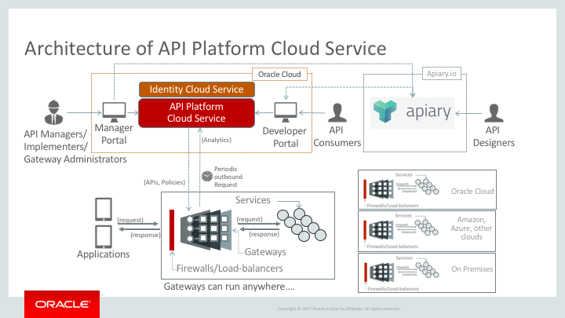
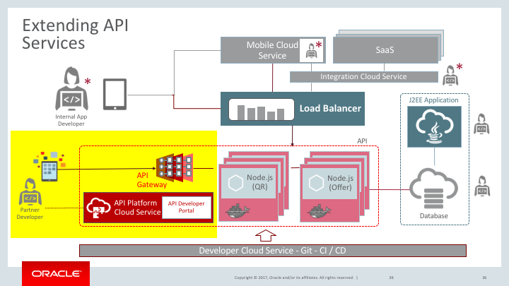

# Oracle APAC Cloud Test Drive

Last Update: July 24, 2017

## API Platform Cloud Service Lab

This lab shows you how to use API Platform Cloud Service to provide full lifecycle management to your API.

### Introduction

Over the last few years, there has been a surge in the number business models that have evolved as a result of a thriving API economy. Robust API platforms have been a major factor in driving this profound change. A similar transformation has been taking place in the enterprise space. Large volumes of enterprise workloads have shifted from traditional corporate data centers to large public clouds. API platforms are rapidly being adopted by enterprise customers in order to meet the demands of an growing API economy so they can continue to stay competitive and relevant in a rapidly evolving world.

### API Platform Cloud Service

Oracle API Platform Cloud Service (APIPCS) enables enterprises to "API enable" new or existing services and manage these end-points. The goal of APIPCS is to provide enterprises the necessary means to succeed with APIs in their core business. This is made possible by making it simple and easy to create, manage, secure, and advertise APIs.

There are several components to the Oracle API Platform Cloud Service: the Oracle Public Cloud My Services Console, the API Platform Gateway, the API Platform Management Portal, and the API Platform Developer Portal.

Following is short descriptions of each of those components.

- **Oracle Public Cloud My Service Console**: Provision new service instances, start and stop service instances, initiate backups, and perform other lifecycle management tasks.
- **API Platform Gateway**: This is the security and access control runtime layer for APIs. Each API is deployed to a gateway node from the Management Portal or via the REST API.
- **API Platform Management Portal**: This is used to create and manage APIs, deploy APIs to gateways, and manage gateways, and create and manage applications. You can also manage and Deploy APIs and manage gateways with the REST API.
- **API Platform Developer Portal**: Application developers subscribe to APIs and get the necessary information to invoke them from this portal.

In addition to the above components, API Platform Cloud Service can also be integrated with Apiary to add Apiary documentation to an API.

## About the Exercise Today

The company is extending the **Loyalty Management System** to provide **partner** access to the offers information.

- the original Offer API in Microservice Lab will be exposed to partner via API Platform Cloud Service
- partners will able to search, view and subscribe to the Offer API
- additional policy, such as rate limits will be added    

## [Start The Lab](ApiPlatformLab.md)
